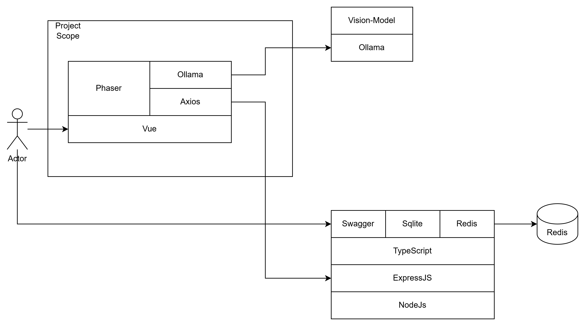

(Still writing the README.md)

# Phaser Vue Template

This is a Phaser 3 project template that uses the Vue framework and Vite for bundling. It includes a bridge for Vue to Phaser game communication, hot-reloading for quick development workflow and scripts to generate production-ready builds.
from https://github.com/phaserjs/template-vue


## 1. Architecture


## 2. Frameworks and Libraries
```
- Vue 3
- Vue Router
- Phaser 3
- Vite
- JavaScript
- Axios
- Ollama
```


## 3. Docker container creation and execution command
```
npm run build-nolog
docker build -t vue3-demo:local .  && docker run -p 9090:80 vue3-demo:local
```